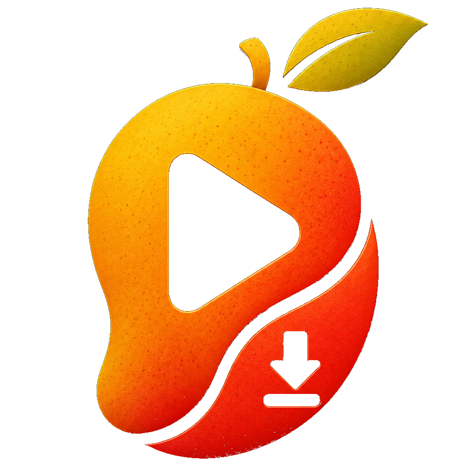
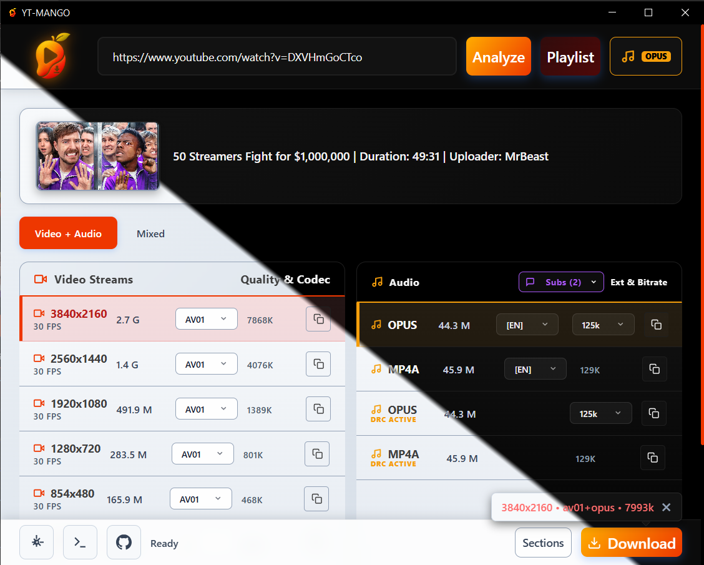
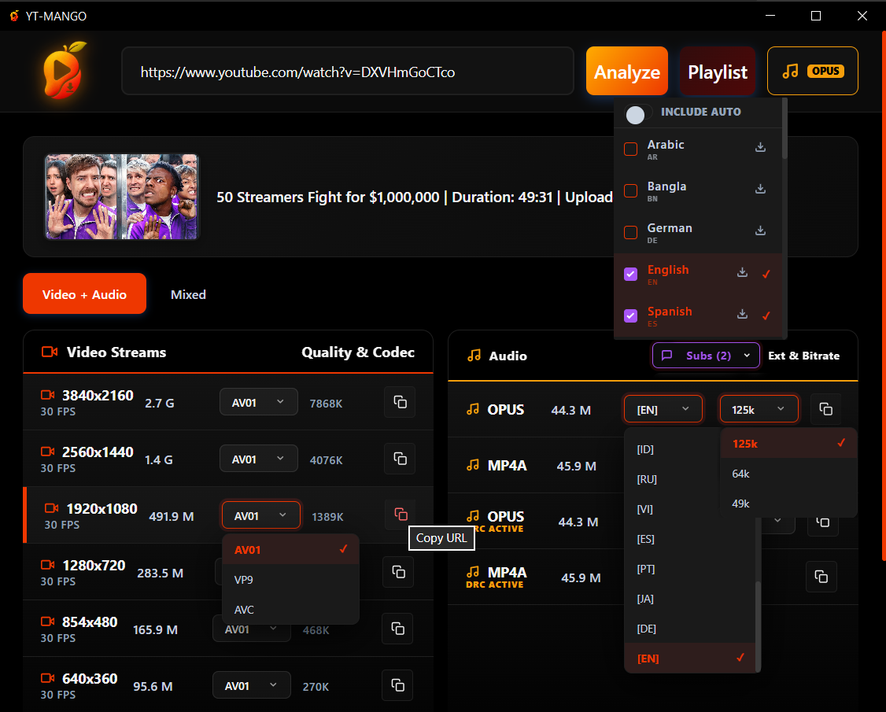
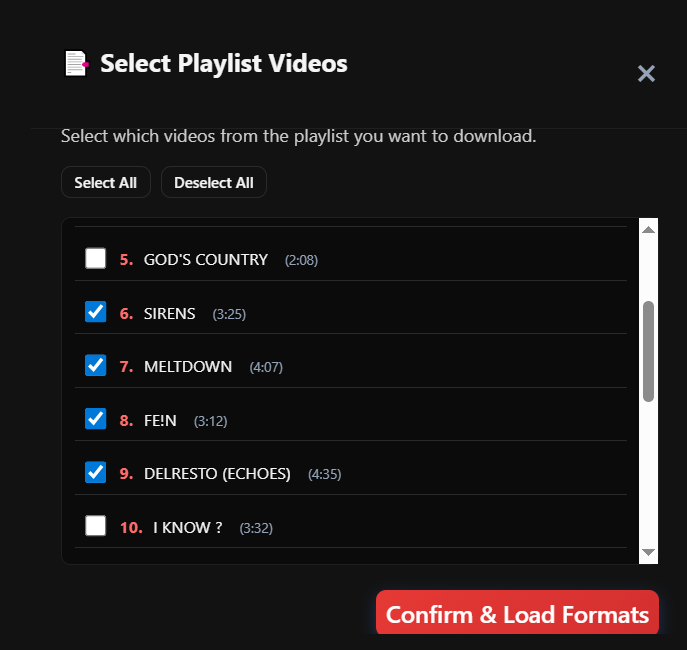
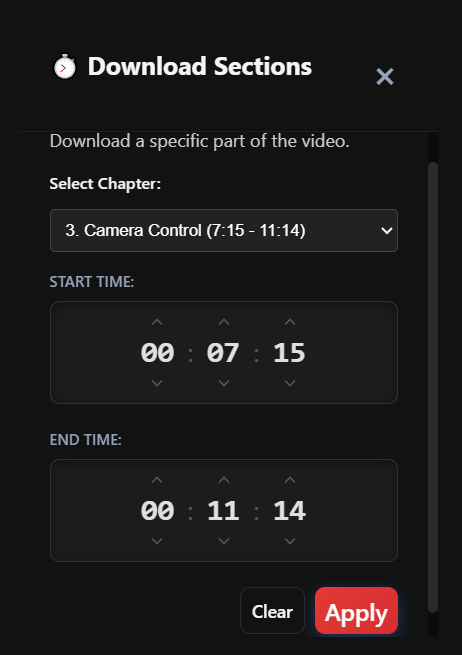
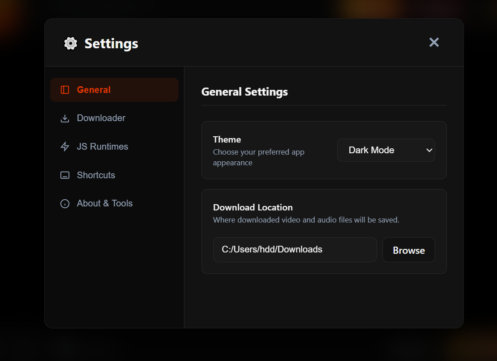

# YT-MANGO

A modern, beautiful desktop GUI for [yt-dlp](https://github.com/yt-dlp/yt-dlp).

Download videos from YouTube, Bilibili, Twitter/X/Twitch/Kick and [1000+ websites](https://github.com/yt-dlp/yt-dlp/blob/master/supportedsites.md) with ease.

---

## Why YT-MANGO?

yt-dlp is powerful, but its command-line interface can be intimidating. **YT-MANGO** wraps it in a clean, native desktop app — no terminal needed.

- **Zero config to start** — paste a link, pick a quality, click download
- **Native & lightweight** — built with neutralino.js, ~10 MB installer, low memory usage
- **Cross-platform** — Windows, macOS, and Linux
### 📸 Screenshots

| Main Interface |
| :---: |
|  |
| **** |

| Selection Options |
| :---: |
|  |
| ** |

| Playlist Manager | Download Sections |
| :---: | :---: |
|  |  |
| ** | ** |

| drag and drop url | App Settings |
| :---: | :---: |
|  |  |
| ** | ** |

## Features

### Core

- Paste a video URL and instantly preview title, thumbnail, duration, and available formats
- Choose video quality, audio-only, or video-only downloads
- Download queue with pause / resume / cancel controls
- Real-time progress with speed and ETA display
- Playlist support — download all or selected items
- Configurable concurrent downloads and fragment threading

### Settings
- **Download Location**: Choose custom download folder
- **Cookies File**: Use cookies for authentication
- **Metadata Options**: Embed thumbnails and metadata
- **Download Behavior**: Configure playlist handling and error management

### Advanced

- Embed subtitles, thumbnails, and metadata, into the output file
- SponsorBlock integration — automatically skip sponsored segments
- Cookie authentication for age-restricted or members-only content
- Light / Dark / Auto theme

---
*Click on any image to view in full size.*
---
*Click on any image to view in full size.*
## Getting Started

### 

Grab the latest release for your platform from 
### 

###
### 📥 Download

### First Launch

1. Open the app and go to **Settings**
2. Click **Download** next to yt-dlp — the binary is fetched automatically
3. *(Optional)* Install **Deno** runtime for full YouTube format support
4. Set your **download directory**
5. Go back to the home page, paste a URL, and start downloading

> [!TIP]
> If you encounter login-required videos, configure Cookie in settings using Netscape format text or a cookie file.

### Option 2: Build from Source
1. Install [Neutralinojs](https://neutralino.js.org/docs/getting-started/your-first-neutralinojs-app)
2. Clone this repository
3. Run `neu build`
4. Copy `yt-dlp.exe` and `ffmpeg.exe` to `dist/yt_dlp_gui/`

## Usage

1. **Paste URL**: Enter a video URL in the input field
2. **Analyze**: Click "Analyze" to fetch available formats
3. **Select Format**: Choose from Video Only, Audio Only, or Mixed tabs
4. **Download**: Click on your preferred quality and hit "Download"

### Quick M4A Download
Click the "M4A" button for instant audio download without format selection.

### Settings
- **Download Location**: Choose custom download folder
- **Cookies File**: Use cookies for authentication
- **Metadata Options**: Embed thumbnails and metadata
- **Download Behavior**: Configure playlist handling and error management

## Technical Details

- **Framework**: Neutralinojs 6.4.0
- **Languages**: HTML, CSS, JavaScript
- **Backend**: yt-dlp CLI
- **Architecture**: Lightweight native application (~5MB)

## License

MIT License - See LICENSE file for details

## Credits

- Built with [Neutralinojs](https://neutralino.js.org/)
- Powered by [yt-dlp](https://github.com/yt-dlp/yt-dlp)
- Uses [ffmpeg](https://ffmpeg.org/) for media processing

## Version

Current Version: 5.0.0
